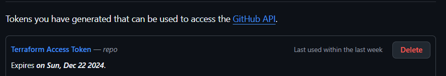
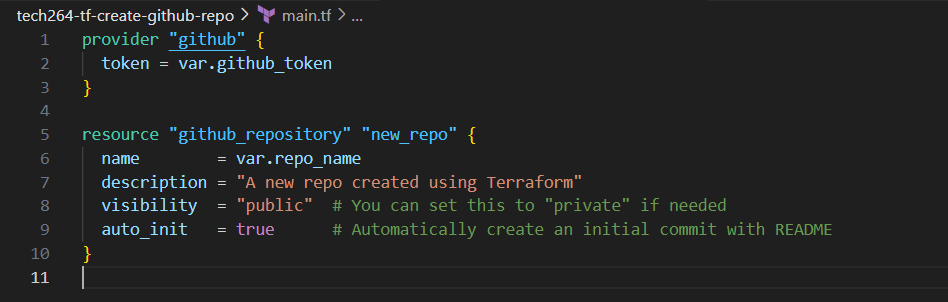
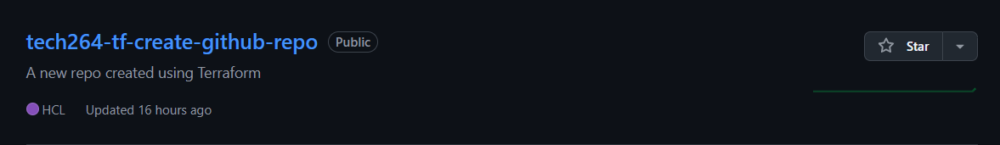

# ***Creating a GitHub repo using Terraform*** 🐙
- [***Creating a GitHub repo using Terraform*** 🐙](#creating-a-github-repo-using-terraform-)
  - [***Steps to create GitHub Repo*** 🪜](#steps-to-create-github-repo-)
  - [***How Terraform is Given Permission:*** 🔐](#how-terraform-is-given-permission-)

## ***Steps to create GitHub Repo*** 🪜
1. Create a folder with an appropriate name in your local directory
2. Create a main.tf file with github as the provider and a variable.tf file that you will later place your github token in
3. Go to GitHub, log in and go to settings and scroll all the down to **Developer Settings** on the left-hand side 
4. Once you are in **Developer Settings**, scroll down and select **Personal Access Token** and select **Tokens (Classic)**
5. Select **Generate New Token(Classic)**
6. Add a name for the token in the **Note** section
7. Select create and you should have a new GitHub token
 

8. Copy your guthub token value as you will **NOT** be able to access it again.
9. In your variable.tf file, create two variables, one for your GitHub Token and one for the name of your new GitHub Repo
10. Make sure you have a **.gitignore** file with the appropriate files inside so you **DO NOT** push credentials to GitHub.
11. This is what your main.tf file should look like in order to call those variables

 

12. Open a new **Git Bash** window, run the terraform commands `init, plan and apply` in that sequence
13. You should have a GitHub repo created for you.
 

 

---

## ***How Terraform is Given Permission:*** 🔐
GitHub Provider: Uses the Personal Access Token for authentication.
You set the token as a variable and reference it in the main.tf file using var.github_token.